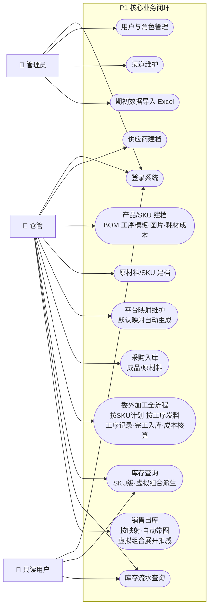
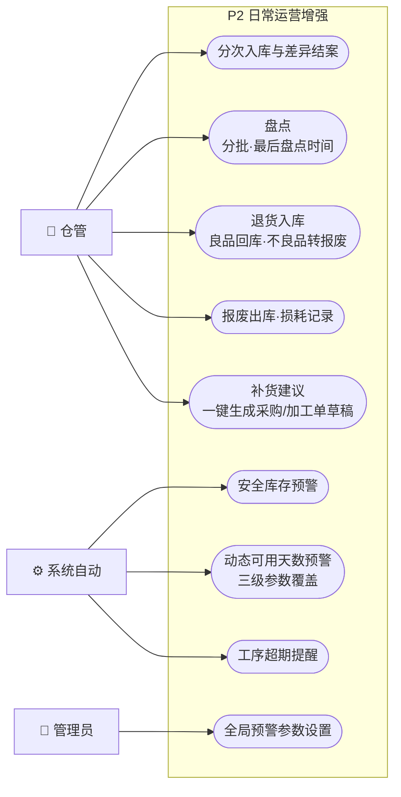
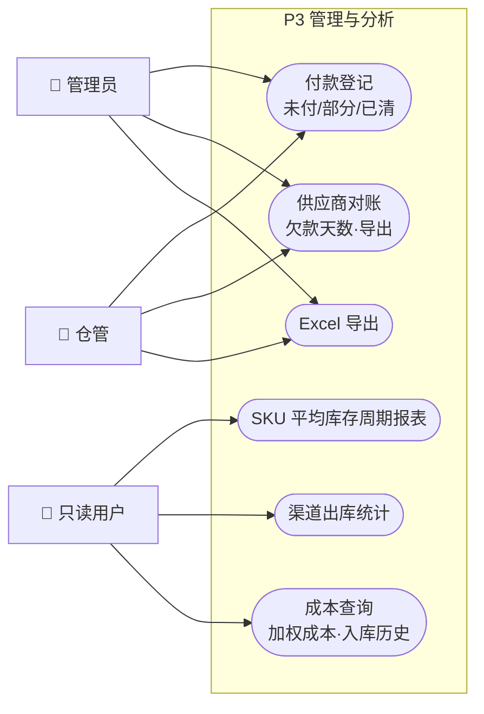

# PocoERP 用例图（基于需求文档 v1.14）

> 按功能优先级分 3 组：P1 核心业务闭环 → P2 日常运营增强 → P3 管理与分析。
> Mermaid 无原生 UML 用例图，使用 flowchart 模拟：方框 = 角色（Actor），圆角框 = 用例（Use Case）。

## P1 核心业务闭环（系统跑起来的最小集合）

## P2 日常运营增强（业务跑顺后很快需要）

## P3 管理与分析（管理决策支撑）

## 分组依据

| 组 | 标准 | 对应需求章节 |
|----|------|--------------|
| P1 | 没有它业务闭环走不通（建档→入库→加工→库存→出库） | 4.1~4.6、4.7 主功能、4.8 销售出库、4.12、4.13 |
| P2 | 不影响开单，但日常运营效率和准确性依赖它 | 4.5 分次入库、4.7.1 盘点、4.14、4.8 报废、4.9 预警/补货/超期 |
| P3 | 周期性管理动作与决策分析 | 4.5/4.6 付款、4.9 对账/周转/渠道统计、4.10 导出 |

> 建议开发顺序也按 P1 → P2 → P3 推进，每期结束都可用第 9 章对应情景验收。
